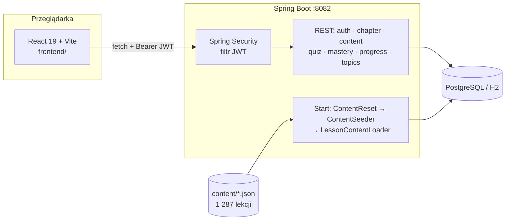

<div align="center">

# 🧭 JavaQuest

**Interaktywna platforma do nauki programowania — teoria, zadania i quizy, które uczą na długo, a nie tylko na jutro.**


[Kursy](#-kursy) · [Jak się tu uczy](#-jak-się-tu-uczy) · [Mastery](#-mastery--gwiazdki-które-się-starzeją) · [Szybki start](#-szybki-start) · [API](#-api) · [Architektura](#-architektura) · [Dokumentacja](#-mapa-dokumentacji)

</div>

---

JavaQuest zaczął się jako moja osobista encyklopedia i repetytorium Javy — lekcja po lekcji, od
zmiennych po mikroserwisy. Dziś to **pełna aplikacja webowa** (Spring Boot + React), która serwuje
ten kurs i dwa kolejne, z kontem użytkownika, postępem i quizami ocenianymi po stronie serwera.

## 📚 Kursy

Przełącznik na panelu głównym — trzy równoległe tory na jednym backendzie:

| Tor | Rozdziały | Lekcje | Pytania quizowe | Zadania | Stan |
|---|---:|---:|---:|---:|---|
| ☕ **Java** (domyślny) | 41 | 760 | ~68 800 | ~20 900 | ✅ kompletny |
| 🟨 **JavaScript** | 14 | 90 | ~9 000 | ~2 700 | ✅ kompletny |
| 🐧 **Linux** | 46 | 437 | — | — | 🚧 teoria w toku |

Kurs Javy prowadzi od podstaw języka, przez OOP, kolekcje, wielowątkowość, JDBC, Hibernate i cały
ekosystem Springa (Boot, Data JPA, Security, testy, WebFlux, messaging, Cloud), aż po algorytmy,
architekturę i bazy NoSQL. Każda lekcja to:

- 📖 **Teoria** — bloki w stałym standardzie: wstęp, definicje, analogie, przykłady kodu,
  „źle / dobrze”, pułapki, notatki;
- 🛠️ **Zadania** — z podpowiedzią i rozwiązaniem do odsłonięcia;
- ❓ **Quiz** — pula zwykle **100 pytań ABCD** z wyjaśnieniem każdej odpowiedzi.

Dodatkowo zakładka **„Krytyczne tematy”** zbiera zagadnienia, które najczęściej wracają na rozmowach
rekrutacyjnych.

## 🧠 Jak się tu uczy

Platforma jest projektowana pod **długoterminowe zapamiętywanie**, a nie zbieranie punktów:

| Idea | Jak jest zrealizowana |
|---|---|
| **Retrieval practice** | quiz to ćwiczenie przypominania, nie egzamin — natychmiastowy feedback i wyjaśnienie po każdej odpowiedzi, bez kar za błędy |
| **Rotacja pytań** | z puli ~100 serwer losuje 20, najpierw te, których jeszcze nie widziałeś; kolejność zawsze inna |
| **Powrót do błędów** | do 5 pytań, na które ostatnio odpowiedziałeś źle, wraca w kolejnym losowaniu |
| **Spacing** | kolejne gwiazdki dają tylko powtórki po przerwie — trzy zaliczenia z rzędu niczego nie dają |
| **Mastery learning** | zaliczenie od 80% poprawnych (16 / 20), niezaliczony quiz = nowe losowanie |
| **Bez presji** | nie ma streaków, leaderboardu ani zablokowanych rozdziałów — każda lekcja jest zawsze otwarta |

## ⭐ Mastery — gwiazdki, które się starzeją

Przy każdej lekcji widać jej **stan opanowania**:

```
HashMap        ★★☆
TreeMap        ★☆☆   Warto powtórzyć
LinkedHashMap  ☆☆☆   Proponowana następna
```

Gwiazdki to **aktualnie potwierdzona wiedza**, nie XP. Zdobywa się je wyłącznie zaliczonym quizem,
a kolejne tylko powtórką po przerwie:

```
 ☆☆☆ ──zaliczony quiz──▶ ★☆☆ ──powtórka następnego dnia──▶ ★★☆ ──powtórka po tygodniu──▶ ★★★
                           ▲                                  │  ▲                          │
                           └──────── długo bez powtórki ──────┘  └── długo bez powtórki ────┘
                                     (★ to podłoga)                (powtórka przywraca ★)
```

- **Quiz zawsze można rozwiązać.** Zaliczenie „za wcześnie” jest zapisane, ale gwiazdki nie rusza.
- **Błędy nic nie zabierają** — gwiazdka może zniknąć tylko przez długi brak powtórek.
- **Nie zobaczysz żadnych dat ani liczników** — tylko stan wiedzy i neutralne „Warto powtórzyć”.
- Ćwiczenia programistyczne nie dają gwiazdek (platforma nie wykonuje kodu, a kliknięciu
  „zrobione” nie ufamy). Checkbox „Zrobiłem tę lekcję” zostaje — to osobna, prywatna notatka.

<details>
<summary><b>Szczegóły dla dewelopera</b></summary>

- Mastery **nie jest zapisywane** — to deterministyczna funkcja historii zaliczonych podejść
  (`quiz_attempts`) i bieżącego czasu z wstrzykiwanego `Clock`. Brak schedulera, brak migracji
  przy zmianie reguł, nie da się przyznać gwiazdki dwa razy.
- Wszystkie interwały w jednym miejscu: `MasteryProperties` / `platform.mastery.*`:

  | Parametr | Domyślnie | Znaczenie |
  |---|---|---|
  | `min-questions` | 10 | podejście z mniejszą liczbą pytań nie jest zdarzeniem mastery |
  | `spacing-level1` | 20h | ★ → ★★ |
  | `spacing-level2` | 6d | ★★ → ★★★ |
  | `spacing-level3` | 30d | odświeżenie ★★★ (reset starzenia) |
  | `retention-level3` | 60d | ★★★ bez powtórki → ★★ |
  | `retention-level2` | 30d | ★★ bez powtórki → ★ |

- Pełny projekt, uzasadnienie wartości i scenariusze: [`MASTERY_V1_PLAN.md`](MASTERY_V1_PLAN.md).

</details>

## 🚀 Szybki start

**Wymagania:** JDK 21+, Node.js 20+, Docker (opcjonalnie — jest tryb H2 w pamięci).

```bash
# 1. Baza danych (PostgreSQL 16 zgodny z domyślną konfiguracją)
docker compose up -d

# 2. Sekrety: skopiuj wzór i uzupełnij hasło SMTP + sekret JWT
cp src/main/resources/javaquest-platform-secrets.properties.example \
   src/main/resources/javaquest-platform-secrets.properties

# 3. Frontend → src/main/resources/static
cd frontend && npm install && npm run build && cd ..

# 4. Backend (port 8082)
./mvnw spring-boot:run -Dspring-boot.run.mainClass=com.example.javaquest.web.JavaQuestApplication
```

Aplikacja: **http://localhost:8082** · Swagger UI: **http://localhost:8082/swagger-ui.html**

| Wariant | Jak |
|---|---|
| Bez Dockera / Postgresa | dodaj `--spring.profiles.active=h2` (baza w pamięci, dane znikają po restarcie) |
| Frontend z hot-reloadem | `cd frontend && npm run dev` |
| Bez wysyłki maili (dev) | `app.mail.confirmation-required=false` w pliku secrets — konto aktywne od razu |
| Windows | `mvnw.cmd spring-boot:run "-Dspring-boot.run.mainClass=com.example.javaquest.web.JavaQuestApplication"` |

### 🔐 Konto i logowanie

Cały `/api/**` wymaga tokenu JWT (poza rejestracją, logowaniem, potwierdzeniem i resetem hasła).

```
rejestracja ──▶ mail z linkiem /potwierdz?token=… (24 h) ──▶ aktywacja ──▶ logowanie (JWT, 7 dni)
```

Konfiguracja platformy żyje w `src/main/resources/javaquest-platform.properties` (baza, Hibernate
`ddl-auto=update`, SMTP Gmail, JWT, quiz, mastery). Hasło SMTP (*hasło aplikacji* Google) i sekret
JWT trzymaj w `javaquest-platform-secrets.properties` — plik jest w `.gitignore`.

## 🔌 API

| Metoda | Ścieżka | Opis |
|---|---|---|
| `POST` | `/api/auth/register` · `/login` · `/forgot-password` · `/reset-password` | konto |
| `GET` | `/api/auth/confirm?token=` · `/api/auth/me` | aktywacja, bieżący użytkownik |
| `GET` | `/api/chapters?track=JAVA\|JAVASCRIPT\|LINUX` | rozdziały toru |
| `GET` | `/api/chapters/{c}/lessons` | lekcje rozdziału |
| `GET` | `/api/chapters/{c}/lessons/{l}/theory` · `/exercises` | treść lekcji |
| `GET` | `/api/chapters/{c}/lessons/{l}/quiz` | stan quizu + mastery lekcji |
| `POST` | `/api/chapters/{c}/lessons/{l}/quiz/attempts` | start (lub wznowienie) podejścia |
| `POST` | `/api/chapters/{c}/lessons/{l}/quiz/attempts/{id}/answers` | odpowiedź na jedno pytanie |
| `GET` | `/api/mastery[?track=]` | gwiazdki wszystkich lekcji użytkownika |
| `GET` | `/api/mastery/reviews[?track=]` | lekcje, przy których powtórka teraz coś da |
| `GET` · `PUT` | `/api/progress` · `/api/chapters/{c}/lessons/{l}/progress` | checkbox „zrobione” |
| `GET` | `/api/critical-topics` | krytyczne tematy rekrutacyjne |

Quiz jest odporny na typowe sztuczki: pytania i wynik liczy serwer, poprawna odpowiedź wraca dopiero
po udzieleniu własnej, odpowiedzi nie da się zmienić, otwartego podejścia nie da się porzucić i
wylosować od nowa, a równoległe wysłanie tej samej odpowiedzi kończy się `409` (blokada optymistyczna).

## 🏗️ Architektura



- **Treść jest pochodną plików** `src/main/resources/content/<rozdział>/<lekcja>.json` — przy każdym
  starcie tabele treści są czyszczone i zasiewane od nowa (edycja JSON-a = restart, bez migracji).
- **Dane użytkownika są trwałe** (`app_user`, tokeny, `lesson_progress`, `quiz_attempts`,
  `quiz_attempt_questions`) i wskazują lekcje **kluczami naturalnymi** (slug rozdziału + lekcji, numer
  pytania), więc przeżywają każdy reseed treści.
- Platforma żyje w `com.example.javaquest.platform.*` (domena) i `com.example.javaquest.web`
  (bootstrap) — celowo odizolowana od kodu lekcji kursu, który ma własne konteksty Springa.

```
javaQuest/
├── frontend/                       React + Vite (strony, komponenty, kontekst postępu)
├── src/main/java/com/example/javaquest/
│   ├── web/                        punkt wejścia aplikacji, SPA fallback
│   ├── platform/
│   │   ├── auth/  user/            rejestracja, JWT, maile, reset hasła
│   │   ├── chapter/  content/      rozdziały, lekcje, ładowanie treści z JSON
│   │   ├── quiz/                   losowanie, ocena, historia podejść
│   │   ├── mastery/                gwiazdki: polityka, konfiguracja, endpointy
│   │   ├── progress/  topics/      checkbox „zrobione”, krytyczne tematy
│   └── liveCodeVersion/            kod źródłowy lekcji kursu Java (podstawa programowa)
├── src/main/resources/content/     treść lekcji wszystkich torów (JSON)
└── dodatkowe materiały/            materiały źródłowe kursów JS i Linux
```

## 🧪 Testy

```bash
./mvnw test -Dtest='MasteryPolicyTest,MasteryServiceTest,QuizRulesTest,QuizMasteryIntegrationTest,LessonContentFilesTest'
```

| Test | Co sprawdza |
|---|---|
| `MasteryPolicyTest` | zdobywanie, spacing, anty-farming, starzenie, odzyskiwanie, granice interwałów |
| `MasteryServiceTest` | niezależność użytkowników, lekcji i torów JAVA / JAVASCRIPT / LINUX, kolejka powtórek |
| `QuizRulesTest` | próg zaliczenia, losowanie, preferencja niewidzianych, powrót błędnych pytań |
| `QuizMasteryIntegrationTest` | pełny przepływ quiz → gwiazdki na H2 z przestawianym zegarem, 409 przy powtórnej odpowiedzi |
| `LessonContentFilesTest` | poprawność wszystkich plików treści lekcji |

Testy czasu nigdy nie używają realnego zegara — `Clock` jest wstrzykiwany.

## 🗺️ Mapa dokumentacji

| Plik | Do czego |
|---|---|
| [`CLAUDE.md`](CLAUDE.md) | punkt wejścia — wskazuje właściwe pliki instrukcji |
| [`MASTERY_V1_PLAN.md`](MASTERY_V1_PLAN.md) | projekt systemu mastery (analiza, algorytm, decyzje) |
| [`STAGE2_LESSON_REDESIGN_PROMPT.md`](STAGE2_LESSON_REDESIGN_PROMPT.md) · [`WORK_PROGRESS.md`](WORK_PROGRESS.md) | standard i stan prac nad kursem Java |
| [`JS_COURSE_STAGE_PROMPT.md`](JS_COURSE_STAGE_PROMPT.md) · [`JS_COURSE_WORK_PROGRESS.md`](JS_COURSE_WORK_PROGRESS.md) | kurs JavaScript |
| [`LINUX_COURSE_STAGE_PROMPT.md`](LINUX_COURSE_STAGE_PROMPT.md) · [`LINUX_COURSE_WORK_PROGRESS.md`](LINUX_COURSE_WORK_PROGRESS.md) | kurs Linux |
| [`EDU_PLATFORM_PLAN.md`](EDU_PLATFORM_PLAN.md) · [`COURSE_CONTENT_HISTORY.md`](COURSE_CONTENT_HISTORY.md) | archiwum: historia platformy i pisania kursu Java |

## 🧰 Stos technologiczny

**Backend:** Java 21 · Spring Boot 3.4 (Web, Data JPA, Security, Mail, Validation) · Hibernate ·
JJWT · springdoc-openapi · PostgreSQL 16 / H2 · JUnit 5 · Mockito · AssertJ
**Frontend:** React 19 · React Router 7 · Vite 8 · oxlint
**Narzędzia:** Maven Wrapper · Docker Compose · Git

---

<div align="center">

🚧 Projekt rozwijany lekcja po lekcji — kolejne w drodze.

</div>
